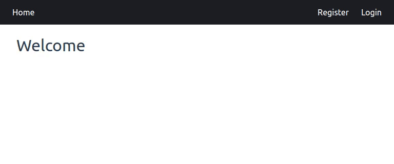
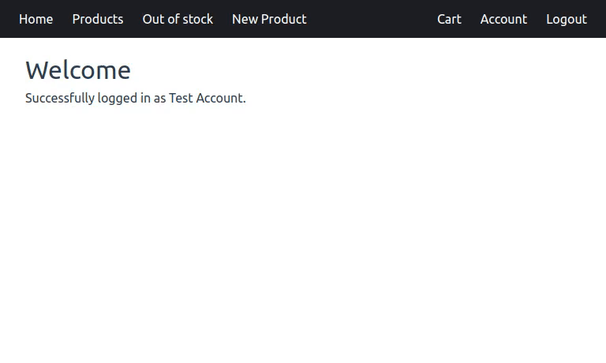
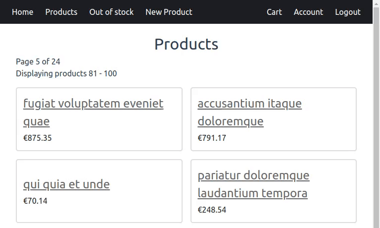
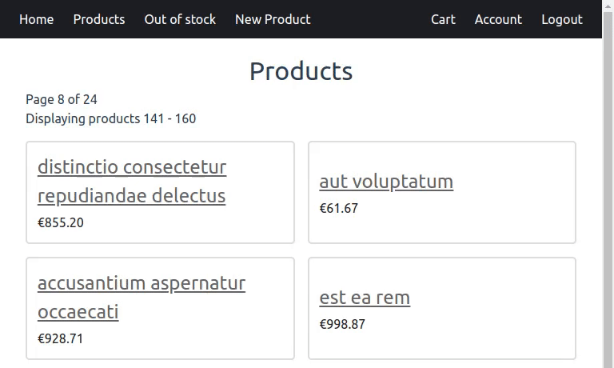

# E-commerce

### Login



### View products


### Add new products



### Edit products



### Add products to cart



## Technologies used

- PHP 8.0
- mySQL 8.0
- Composer 2.4
- Node.js npm 8.19
- Laravel 9.51

## Instructions

1. Clone this repository and navigate to its directory by using the commands:
    ```
    git clone https://github.com/tomskoralis/e-commerce
    cd e-commerce/
    ```
2. Install the required packages by using the commands:
    ```
    composer install --working-dir=backend/
    npm install --prefix frontend/
    ```
3. Make a copy of the `.env.example` and rename the copy to `.env` by using the command:
    ```
    cp backend/.env.example backend/.env
    ```
4. Generate a new `APP_KEY` by using the command:
    ```
    php backend/artisan key:generate
    ```
5. Create a new mySQL database schema.
6. Enter the mySQL credentials in the `.env` file. The variable names are: `DB_DATABASE`, `DB_USERNAME`, `DB_PASSWORD`.
7. Run the database migrations and seed the database by using the command:
    ```
    php backend/artisan migrate:fresh --seed
    ```
8. Run the backend server by using the command:
    ```
    php backend/artisan serve
    ```
9. Run the frontend server using the command in another terminal window:
    ```
    npm run dev --prefix frontend/
    ```
10. Test the website by opening it in the browser using the URL http://localhost:5173/
